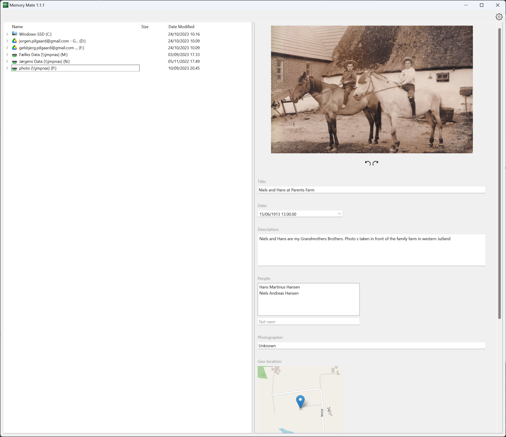
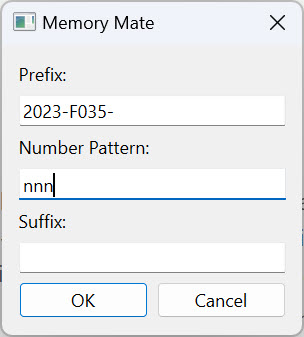

# Memory Mate
## Memories are dear
How happy I always get when turning an old photo finding some written words like..
*Our trip to Rome in 1948. This was the year we first met. In the photo you can see my beloved Lisa and I at "La Scalinata di Trinità dei Monti"*
Greetings from passed times. I want to put greetings on "the back" of our digital family photos and videos in the same way. To be sure the greetings will always follow the photos, it needs to be put in metadata, so that it is readable (almost) everywhere. This can be combersome. There are so many different filetypes and even more types of metadata-tags. The goal of this python windows-application is to encapsulate the complexity, so that you can focus on enriching *your* dear memories for times to come...

## How does it look

## Installation
There are two ways to install the application:
### 1. Installation package
Running Install.exe will do all for you
### 2. Distributable folder
Extract files in Distributable.zip to a folder you created for the Memory Mate App.
After that you can start the App by running the "Memory Mate.exe" in the App-folder you created.
The benifit of the distributable folder is that it can be held on a USB and moved from computer to computer.

Go to https://github.com/JorgenMygindPilgaard/MemoryMate/releases/latest and follow the instructions.

### Get Source-code
You can use the souce-code from repsitory freely, suggest changes etc. The application is created using Python 3.11 and PyQt6. 

## How does it work
The application wrappes the amazing [ExifTool by Phil Harvey. ](https://exiftool.org/)
The application works with what I have chosen to call *logical tags*. These are tags that only the application knows of. The defaults are:
* Tille
* Date
* Description
* People
* Geo-location
* Photographer
* Source
* Original Filename
* Full Description

These logical tags are all visible in the right hand section of the UI below the image preview.

When you use Memory Mate to change the content of one of the logical tags (e.g. if you change the title of a photo), the program writes the changed value to one or more physical tags in the file metadata. 
The *Full Description* is a special type of logical tag called a *reference tag.* In the default settings, *all* other logical tags are referenced in the *Full Description*. The *Full Description* reference tag is saved to commenly used physical tags for image-description, so that you will be sure to be able to see all information, also in programs only capable of showing one of the physical tags for description.
### Functionalities
#### Edit Logical Tags
Just select a file and start typing. The data is saved when you navigate away from image or close application.
For editing geo-location, click the window just below tag name "Geo-location". This will open a bigger window where you can search and pick a location. (Notice that showing and editing geo-location requires intenet-access. If you don't have internet-access, you can still use the application, but you are not able to view/edit geolocation)
For editing image orientation/rotation, use the rotation-buttons below the image.
#### Consolidate metadata
Do you have images with title, description etc. not written to all physical tags. No problem. Select the relevant file/files/folder/folders in the left hand side of the UI, right-click and select "Consolidate metadata". The program will then make sure to "spread" the logical tags to all corresponding physical tags in the selected images.
#### Copy metadata
Mark the file/files/folder/folders. Then right-click the selection and select "Copy Metadata". Then select target file/files/filder/folders, right-click, tick the tags you want to paste (take care not pasting all tags. Can't be regretted), and select "Paste Metadata". If you have chosen more than one source-file, the "Paste Metadata" option is greyed out, and can't be used. You can in stead chose "Paste Metadata by Filename". When you paste using that option, Memory Mate will copy metadata from files in the selected source to metadata of files *with the same filename* in the target (ignoring the file type). That is very handy, if you store your original, raw files in a separate folder, and have edited metadata for all the corresponding jpg-files. You can then simply paste by filename to your original raw-files in one go.

#### Standardize filenames
If you have a folder with multible files and folders below, and you want to rename these files in a systematic way, ordered by date/time taken, the application can help you. Mark the files/folder/folders containing where renaming should take place. Right-click the selection and chose "Standardize Filenames". A popup will now ask you for prefix, numbering and postfix for your naming:

Enter the prefix if needed, the numberpattern (a string of x n's) and if needed a postfix. 
The example above will name the first file "2023-F035-001.jpg", the next "2023-F035-002.jpg" etc. (jpg-files as example). Files with same name (ignoring filetype) will get the same name after renaming also. That way you make sure that original/editet filepairs having same name before standardizing filenames, will also have same name after renaming has taken place.

#### Integration to Adobe Lightroom Classic
If you are using Lightroom Classic on the same computer as Memory Mate, you can have Memory Mate automatically update the filenames in you Lightroom catalouge, when you are using the "Standardize Filenames"-functionality in Memory Mate. By default the feature is switched off but is easily switched on in Memory Mate Settings (click the settings-wheel in top right corner). Just check the "Activate Integration"-checkbox, and enter path to your lightroom catalouge-file (.lrcat) in field below, and the integration will work.
Notice, that Memory Mate utilizes an unofficial API for updating the filenames in the Lightroom Classic. Adobe does not offer an API for updating the catalouge. The integration has been tested with Lightroom Classic v. 13.5. The integration will most likely work with other versions, but there is no guarantee, so keep your lightroom catalouge backed up.

#### Automatic backup running in background
Memory Mate updates image-files when you change logical tag values. Some backup-solutions lock files when doing automatic backup. If an image is locked, Memory Mate will not be able to update the metadata. It is therefore recommended that you pause your backup-program while using Memory Mate to update metadata.

#### Donate
Memory Mate is totally free for you to use. If you like the tool, you can donate an amount via paypal. It absolutly not needed:
https://www.paypal.com/paypalme/JorgenMygindPilgaard
